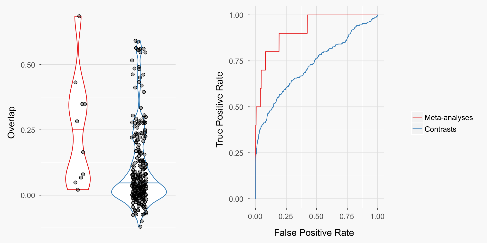
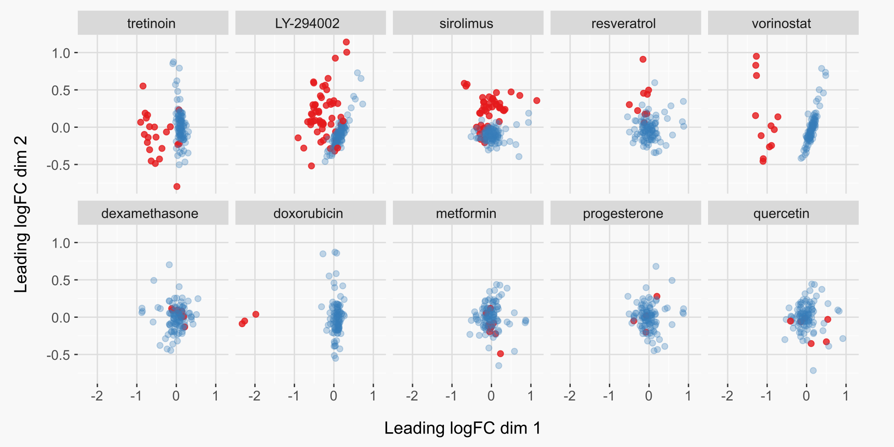

---
output:
  html_document:
    theme: null
    self_contained: true
---

It's possible to greatly improve the reliability of a gene expression signature through meta-analysis with the <a href="https://github.com/alexvpickering/crossmeta" target="blank">crossmeta</a> R package. To evaluate the improvements achieved through meta-analysis, I used the R package <a href="https://github.com/alexvpickering/ccmap" target="blank">ccmap</a>.

ccmap finds drugs that are predicted to reverse or mimic a query gene expression signature. It does this by ranking 1309 different drugs based on the overlap between their gene expression signatures and a query signature. The drug signatures with the most positive and negative overlap with the query signature are predicted to, respectively, mimic and reverse the query signature.

To evaluate crossmeta using ccmap, I used query signatures from samples that were independently treated with 10 of the 1309 drugs assayed in the ccmap data. These query signatures should have the highest overlap with the ccmap drug signatures for the same drugs. If crossmeta is effective, drug signatures resulting from meta-analysis should have higher overlap with the ccmap signature for the same drug than signatures resulting from individual contrasts. For the 10 evaluation drugs, crossmeta was used to generate differential expression signatures for 259 individual contrasts from 125 studies which were then used to generate a single meta-analysis signature for each evaluation drug.

The results were very impressive for crossmeta. Meta-analysis improved the rankings of the queried drugs amongst all other ccmap drugs (figure below - right) and the overlap between the queried drugs and the same ccmap drugs (figure below - left).


<div class="caption"> Meta-analysis increases the overlap (left) and rankings (right) between query and drug expression signatures. On the left each point gives the overlap between a query signature and the ccmap signature for the same drug. Overlaid is a violin plot showing the density and 50th percentile (horizontal line). The ROC curve on the right was generated by calculating the fraction of queried and non-queried drugs that were identified as lower ranks were considered. For each query signature, there was one true positive (the queried drug itself) and 1308 false positives (all other ccmap drugs).
</div>

There are cases where the drug meta-analysis signature had poor overlap with the ccmap signature for the same drug (figure below). Despite this, the meta-analysis signature usually overlapped most strongly with ccmap signatures that either had a similar mechanism of action or a nearly identical chemical structure. This suggests that the fault is with certain ccmap signatures and not with the meta-analysis signature. It also suggests that even when the ideal match has poor overlap, ccmap provides reasonable candidates to mimic the meta-analysis expression signature.


```{r, echo=FALSE, message=FALSE, warning=FALSE, out.width='100%'}
library(plotly)
setwd("~/Documents/Batcave/GEO/1-meta")

drugs <- c("tretinoin", "dexamethasone", "doxorubicin", "LY-294002", "metformin",
           "progesterone", "quercetin", "sirolimus", "resveratrol","vorinostat")

drugs_low <- drugs[c(2, 3, 5, 6, 7)]

paths <- list.files(pattern = "ma_res_sva.rds", full.names = TRUE, recursive = TRUE)
names(paths) <- drugs

# load results
results <- lapply(paths[drugs_low], function(path) {readRDS(path)$meta})

setwd("~/Documents/Batcave/alexvpickering.github.io")

setup_df <- function(top_drugs, special, tag, query_drug) {
    
    df <- as.data.frame(round(top_drugs, 3))
    colnames(df) <- "Overlap"
    df$Drug <- row.names(df)
    df$Rank <- 1:nrow(df)
    
    df$Relationship <- "na"
    df[special, "Relationship"] <- tag
    df[query_drug, "Relationship"] <- "queried drug"
    
    df$query_drug <- query_drug
    
    return(df)
}

#[1] "dexamethasone" "doxorubicin"   "metformin"     "progesterone"  "quercetin" 

specials <- list("dexamethasone" = c("LY-294002", "sirolimus", "wortmannin"),
                 "doxorubicin"   = c("daunorubicin", "hycanthone", "irinotecan",
                                     "etoposide", "resveratrol", "ellipticine",
                                     "camptothecin", "withaferin A"),
                 "metformin"     = c("niclosamide"),
                 "progesterone"  = c("mometasone"),
                 "quercetin"     = c("etoposide", "withaferin A", "resveratrol",
                                     "irinotecan", "hycanthone", "luteolin"))

tags <- list("dexamethasone" = rep("opposes PI3K", 3),
             "doxorubicin"   = c("structure, topoisomerase inhibitor", 
                                 rep("topoisomerase inhibitor", 7)),
             "metformin"     = c("anti-diabetic, mitochondrial uncoupling"),
             "progesterone"  = c("progesterone receptor agonist"),
             "quercetin"     = c(rep("topoisomerase inhibitor", 5),
                                 "structure"))

dfs <- mapply(setup_df, results, specials, tags, names(results), SIMPLIFY = FALSE)
dfs <- lapply(dfs, function(x) {row.names(x) <- NULL; x})
df <- Reduce(rbind, dfs)

df$Relationship <- as.factor(df$Relationship)
alpha <- ifelse(df$Relationship == "na", 0.7, 1)


gg <- ggplot(df, aes(x = query_drug, y = Overlap)) +
    geom_violin(show.legend = FALSE) +
    geom_jitter(aes(drug = Drug,
                    rel = Relationship,
                    rank = Rank,
                    alpha = alpha,
                    colour = Relationship), 
                width = 0.30, show.legend = FALSE) +
    scale_colour_manual(values=c("#377EB8", "black", "#377EB8", "#377EB8",
                                 "#E41A1C", rep("#377EB8", 3))) +
    labs(x="\n", y= "Overlap") +
    scale_x_discrete() +
    theme(panel.background = element_rect(fill = "#f8f8f8"),
          plot.background  = element_rect(fill = "#f8f8f8", colour = "#f8f8f8"),
          legend.background = element_rect(fill = "#f8f8f8"),
          panel.grid.major = element_line(colour = "#dddddd"),
          plot.margin = unit(c(0.3,1,0.3,0.3), "cm"),
          axis.text.x = element_text(angle = 90, hjust=1, vjust=0.5))

m <- list(
    l = 70,
    b = 130
)
    
gg <- ggplotly(gg, tooltip = c("drug", "rank", "rel")) %>% 
    layout(showlegend = FALSE,
           margin = m) 
    
    
gg <- plotly_build(gg)

# only keep hover info for queried drug and identified relationships
gg$data[[1]]$hoverinfo <- "none"
gg
```
<div class="caption"> Query results where drug meta-analysis signatures had poor overlap with the ccmap signature for the same drug (red points). For these cases, the meta-analysis signature usually overlapped most strongly with ccmap signatures that either had a similar mechanism of action or a nearly identical chemical structure (blue points). Each point gives the overlap between a query signature and one ccmap drug signature. Overlaid is a violin plot showing the density of the overlap between each query drug and the ccmap drugs. </div>

To demonstrate more concretely that poor overlap was due to low quality ccmap signatures, let's look at the original ccmap data. We can see that there is good seperation between control and treatment samples for drugs where the meta-analysis signature had a top ten overlap with the ccmap signature for the same drug (figure below - top row). In contrast, ccmap drug signatures with poor seperation had poor overlap with the meta-analysis signature for the same drug (figure below - bottom row). The one exception is doxorubicin, for which the relatively low rank of 51 appears to have resulted from many similar ccmap expression profiles. Although the ccmap signature for doxorubicin was not among the top ten signatures, its absolute overlap was quite high in comparison to other low-ranking queries (figure above).


<div class="caption"> ccmap expression data seperates well between vehicle (blue) and treatment (red) samples for drugs where the meta-analysis signature had high overlap with the ccmap signature for the same drug (top row). In contrast, for drugs where the meta-analysis signature had poor overlap with the ccmap signature for the same drug, ccmap expression data seperates poorly (bottom row). Data for plots was generated using plotMDS from the limma Bioconductor package.
</div>


summary
-------
<br>
Meta-analysis of microarray expression profiles using <a href="https://github.com/alexvpickering/crossmeta" target="blank">crossmeta</a> substantially improves the reliability of gene expression profiles. This was demonstrated using the <a href="https://github.com/alexvpickering/ccmap" target="blank">ccmap</a> Bioconductor package and data from 125 studies that assayed one of ten drugs also assayed for the ccmap data. In comparison to drug signatures from individual contrasts, signatures from meta-analysis had much stronger overlap with the ccmap signatures for the same drugs. For cases where the meta-analysis signature had relatively poor overlap with the corresponding ccmap signature, the ccmap signature was likely at fault. This was concluded after observing poor seperation between treatment and control samples for these ccmap signatures. Additionally, for these cases, the most strongly overlapping ccmap signatures included drugs with similar mechanisms or structure to the meta-analysed drug. This suggests that even when the ideal match has poor overlap, ccmap provides reasonable candidates to mimic the meta-analysis expression signature.


